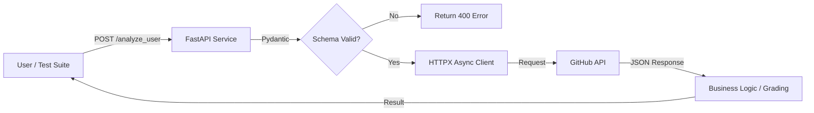

# GitHub Profile Analyzer Service 🚀


## 📋 Overview

A robust, containerized microservice designed to analyze and "grade" GitHub user profiles based on public metrics. 

This project demonstrates a **Senior SDET** approach to modern test architecture, focusing on **Service Mocking**, **Environment Parity**, and **Data-Driven Testing**. It serves as a blueprint for validating 3rd-party API integrations without incurring network latency or rate-limit costs during CI/CD execution.

## 🏗 Architecture

The application acts as a gateway service between the client and the GitHub API. It handles upstream errors, enforces strict schema validation, and transforms raw data into business value.



🛠 Tech Stack

    Application: FastAPI (Python), Pydantic (Data Validation), HTTPX (Async I/O).

    Infrastructure: Docker & Docker Compose (Containerization).

    Testing: Pytest (Runner), Respx (Service Mocking), Pytest-Cov (Coverage).

    CI/CD: GitHub Actions (Automated Linting & Testing).

    Quality: Ruff (Linting), Allure (Reporting).

🧪 Testing Strategy (The "Senior" Approach)

This repository moves beyond simple functional testing by implementing advanced patterns required for enterprise-scale systems.
1. Service Mocking (Respx)

Instead of hitting the real GitHub API during tests (which causes flakiness, rate limits, and latency), the test suite intercepts HTTP requests at the network layer.

    Benefit: Tests run in milliseconds and work offline.

    Resiliency: Allows us to simulate edge cases (e.g., GitHub returning 500 or 503 errors) which are impossible to trigger manually.

<br>

2. Data-Driven Testing (Parametrization)

We utilize pytest.mark.parametrize to run the grading engine against multiple scenarios (Junior, Senior, Rockstar, Edge Cases) using a single test function.

    Benefit: Scales test coverage without code duplication.

<br>

3. Containerized Execution

Tests run inside an isolated Docker container that mirrors production.

    Benefit: Eliminates "It works on my machine" issues.
    
<br>


🚀 Getting Started

Prerequisites

    Docker Desktop (or GitHub Codespaces)

<br>

**Run the Application (Live Mode)**

Spins up the API service locally.
```bash
docker compose up --build api
```

<br>
Access Swagger UI: http://localhost:8000/docs


<br>
Try it out: Send a POST request with {"username": "octocat"}.


<br>
**Run the Test Suite (CI Mode)**

Executes the full regression suite, linter, and coverage report inside the container.
```bash
docker compose up --build tests
```

## 📂 Project Structure

```text
.
├── app/
│   ├── main.py          # FastAPI Gateway Logic
│   └── __init__.py
├── tests/
│   ├── test_main.py     # Parametrized & Mocked Tests
│   └── __init__.py
├── .github/workflows/   # CI/CD Pipeline Configuration
├── Dockerfile           # Multi-stage Docker build
├── docker-compose.yml   # Service orchestration
├── pytest.ini           # Test configuration & markers
└── requirements.txt     # Dependencies
